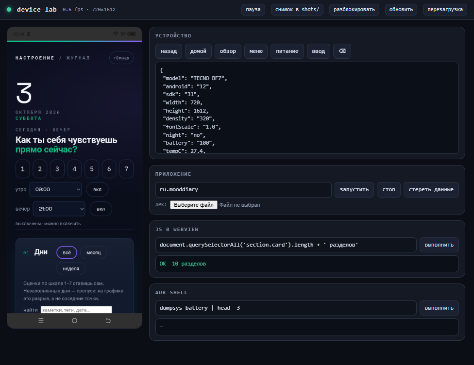

# device-lab

Телефон как лаборатория: один телефон закрывает весь цикл проверки приложений —
снимки экрана, тапы, ввод кириллицы, чтение состояния приложения прямо из WebView,
автосценарии с проверками и отчётом.

Ничего лишнего: PowerShell + adb, без внешних зависимостей. Скрипты лежат здесь,
а не во временной папке, поэтому переживают чистку `Temp`.

## Быстрый старт

```powershell
.\phone.ps1 doctor        # самопроверка: 13 пунктов, что сломано — видно сразу
.\phone.ps1 panel start   # живая панель: экран телефона в браузере, клик = тап
.\phone.ps1 shot -Name glavnyj
.\phone.ps1 info
```

## Что умеет

### Снимки и ввод

| Команда | Что делает |
|---|---|
| `shot [-Name имя] [-Dir папка]` | снимок экрана, печатает путь |
| `tap X Y` | тап по координатам |
| `tapel "#id"` / `tapel ".класс"` | тап по элементу **внутри WebView**: элемент сам прокручивается в центр, координаты пересчитываются с учётом статус-бара |
| `fill "#поле" "текст"` | доводит фокус тапом (до 3 попытки), чистит поле, вводит и возвращает результат |
| `type [-Clear] "текст"` | ввод текста, кириллица идёт через ADBKeyboard в base64 |
| `swipe X Y` / `swipe X1 Y1 X2 Y2` | свайп; короткая форма — прокрутка вниз |
| `key back\|home\|power\|recents\|menu` | клавиши |
| `unlock`, `wake`, `stayon on` | экран и блокировка |

### Состояние приложения (главное для отладки)

| Команда | Что делает |
|---|---|
| `js "expr"` | выполняет JS в WebView и печатает значение. Читать localStorage, считать DOM, звать внутренние функции — всё можно |
| `jsfile script.js` | то же из файла |
| `find "#id"` | координаты элемента без тапа |
| `uia list [-Filter текст] [-Class EditText]` | дерево доступности **нативного** экрана (Compose) |
| `uia tap "текст"` | тап по подписи на нативном экране |
| `uia has "текст"` | `ok` / `none` — для проверок |
| `uiatapclass` в сценариях | тап по N-му полю ввода |

> Про WebView: `uiautomator` иногда отдаёт его дерево, но надёжнее `js`.
> Для нативных экранов наоборот: `js` не работает, нужен `uia`.

### Приложения, сборка, метрики

| Команда | Что делает |
|---|---|
| `install [-Downgrade] путь.apk` | читает пакет и версию через `aapt`, останавливает приложение, ставит APK |
| `apkinfo путь.apk` | пакет, версия, подпись |
| `launch\|stop\|restart\|clear\|uninstall` | жизненный цикл |
| `quiet` / `loud` | погасить всё лишнее / поднять лаунчер |
| `perf ru.mooddiary` | память и кадры (`gfxinfo`) |
| `alarms [пакет]`, `notif [пакет]` | что запланировано и что показано |
| `logs [-Filter текст] [-Lines N] [-Follow]` | logcat |
| `size`, `density`, `font`, `night`, `rotate`, `anim` | имитация других условий без второго телефона |
| `reboot` | перезагрузка |

## Живая панель

```powershell
.\phone.ps1 panel start     # http://127.0.0.1:8099/
.\phone.ps1 panel stop
```

Слева — экран телефона в реальном времени. По нему:

- **клик** — тап, **протяжка** — свайп, **колесо** — прокрутка, **долгое нажатие** — долгий тап;
- справа — состояние устройства, управление приложением, **консоль JS в WebView**,
  `adb shell`, live-logcat с фильтром, имитация условий (шрифт, размер экрана, тёмная тема,
  анимации, координаты под пальцем), установка APK прямо из браузера.

Сервер слушает только `127.0.0.1`, наружу ничего не отдаёт.

## Автосценарии

```powershell
.\run.ps1 -Scenario scenarios\mood-diary.json
.\run.ps1 -Scenario scenarios\chronic-android.json
.\run.ps1 -Scenario scenarios\docs-mood-diary.json -OutDir ..\mood-diary\docs
```

Прогон пишет в `runs\<дата>-<имя>\`: снимки по шагам и `report.md` с таблицей
проверок. Код возврата ненулевой, если есть провалы — можно вешать в CI.

Шаги: `app` (launch/stop/clear/restart), `wait`, `tap`, `tapel`, `fill`, `text`,
`swipe`, `key`, `js`, `uiatap`, `uiatapclass`, `uiatxt`, `shot`, `shell`, `log`.

Проверки в `expect`: `contains`, `notContains`, `eq`, `ne`, `regex`, `gt`, `gte`,
`lt`, `lte`, `exists`, `empty`.

Пример:

```json
{ "do": "js", "label": "запись записана",
  "expr": "JSON.parse(localStorage.getItem('mood_diary_v3')).length",
  "expect": { "gte": 1 } }
```

## Вёрстка под разными условиями

```powershell
.\phone.ps1 layout                      # все профили обоих приложений
.\phone.ps1 layout -Only small-480x854  # один профиль
.\phone.ps1 layout -App mood-diary
```

Профили: свой экран, узкий (480×854), большой (1080×2400), крупный шрифт 1.3,
узкий + шрифт 1.15, горизонтальная ориентация, системная тёмная тема. Для
каждого экрана — снимок и автоматическая проверка:

- **WebView:** страница шире экрана (тот самый grid-blowout), элементы за краем,
  обрезанный текст. Прокручиваемые блоки вроде таблицы журнала не считаются
  ошибкой — они legitimately прокручиваются.
- **Натив:** узлы за границами экрана и подозрительно узкие подписи. Второе
  ловится статистически: считается медиана «пикселей на символ», и всё, что
  в 2+ раза ниже, выглядит как перенос по буквам.

Условия возвращаются как были, даже если прогон упал.

## Подготовка телефона

```powershell
.\prep.ps1            # базовая: экран не засыпает, анимации выкл, портрет, блокировка снята
.\prep.ps1 -Disable   # + отключить сторонний мусор (возврат: pm enable <пакет>)
.\prep.ps1 -Report    # только показать состояние
```

`prep` обратим: всё меняется обратно теми же командами, сторонние приложения
только отключаются, не удаляются.

## Важные грабли

1. **Release-сборка не даёт DevTools.** В release WebView-отладка выключена,
   `js` не работает. Для работы с JS нужен debug-APK; для проверки «как у
   пользователя» — release. Оба надо проверять.
2. **У chronic-android debug-сборка ставится как `ru.chronicnotebook.debug`** —
   это отдельное приложение, правки в нём не видны в основном.
3. **После `install -r` процесс надо убить**, иначе работает старый код.
   `phone.ps1 install` делает это сам по имени пакета из APK.
4. **WebView продолжает отвечать на JS, когда приложение в фоне.** Тапы при
   этом уходят в пустоту. `tapel`/`fill` проверяют, что приложение на экране,
   и возвращают его, если что.
5. **Кириллица через `adb shell input text` не проходит** — PowerShell отдаёт
   аргументы в windows-1251. `type` и `fill` идут через base64 ADBKeyboard.
6. **Отступ сверху берётся из рамки StatusBar** (`dumpsys window`), а не из
   `window.innerHeight`: там не учтена навигация, и значение меняет клавиатура.
7. **Отладочная сборка mood-diary на телефоне сейчас** — чтобы работал `js`.
   Релизный APK лежит в GitHub Releases.

## Скриншот панели

Слева — экран телефона в реальном времени, справа — управление и консоль JS
в WebView приложения.



Клик по изображению — тап, протяжка — свайп, колесо — прокрутка. Экран
обновляется примерно 2–3 раза в секунду: ограничение не в панели, а в самом
`adb screencap` на этом телефоне.
## Настройка ввода кириллицы

```powershell
curl.exe --ssl-no-revoke -sSL -o tools\ADBKeyboard.apk `
  https://raw.githubusercontent.com/senzhk/ADBKeyBoard/master/ADBKeyboard.apk
.\phone.ps1 setup-ime          # ставит APK и выбирает его клавиатурой
.\phone.ps1 ime-restore        # вернуть обычную клавиатуру
```

`ADBInput_B64` — единственный канал, через который кириллица доходит до телефона
неискажённой: `input text` и `ADB_INPUT_TEXT` ломают её на windows-1251.

## Состав

```
phone.ps1        единая точка управления (все команды)
panel.ps1        локальный сервер панели + фоновый процесс
panel.html       интерфейс панели
prep.ps1         подготовка телефона
run.ps1          раннер сценариев
layout.ps1       прогон вёрстки по разным условиям
lib/common.ps1   adb, DevTools-клиент, отступы, дерево доступности
scenarios/       сценарии: дневник, chronic-android, съёмка скриншотов
tools/           ADBKeyboard.apk для ввода кириллицы
shots/ runs/ layout/   снимки, прогоны и отчёты о вёрстке (не в git)
lab-state/       кэш: рамки полос, дерево доступности, pid панели
```